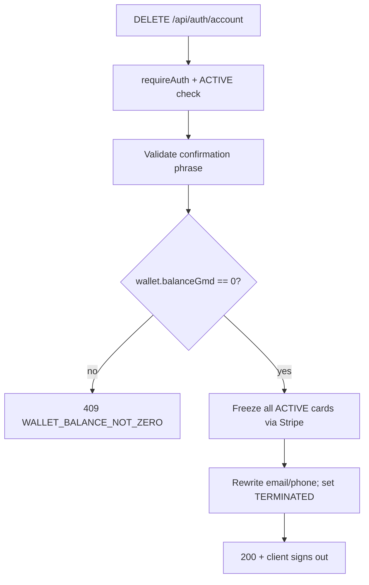

# Account deletion (soft terminate)

## Product rules (confirmed)

- **Wallet**: block terminate if `balanceGmd > 0`; tell user to spend remaining balance (e.g. fund card) or contact support.
- **Card USD**: allow terminate with card balance > 0; **auto-freeze** all non-canceled cards so funds cannot be spent; leftover USDC stays on the terminated account.
- **Irreversible**: typed confirmation required; old user row and related data are **kept**, not hard-deleted.
- **Return later**: same email/phone signs up as a **new** user (new UUID); terminated account left untouched.

## Data model

Add to [`backend/prisma/schema.prisma`](backend/prisma/schema.prisma):

```prisma
enum AccountStatus {
  ACTIVE
  TERMINATED
}

// on User:
accountStatus   AccountStatus @default(ACTIVE) @map("account_status")
terminatedAt    DateTime?     @map("terminated_at")
originalEmail   String?       @map("original_email")  // audit: email before rewrite
```

Migration under `backend/prisma/migrations/`.

**Freeing uniqueness on terminate** (so re-signup works without touching history):

| Field | Action |
|-------|--------|
| `email` | Rewrite to `terminated+{userId}@deleted.vpay.local`; store prior value in `originalEmail` |
| `phone` / `phoneE164` | Clear to `null` |
| `VPayWallet.phoneNumber` | Rewrite to `terminated:{userId}` (keeps wallet row + history) |
| Stripe / DirectPay IDs | Leave as-is on the terminated row |

After rewrite, `findUserByEmail(originalEmail)` returns null → OTP verify creates a new user via existing `createUser`.

## Backend termination flow



**New endpoint:** `DELETE /api/auth/account` in [`backend/src/routes/auth.ts`](backend/src/routes/auth.ts), registered in [`backend/src/index.ts`](backend/src/index.ts).

Body:

```json
{ "confirmation": "DELETE MY ACCOUNT" }
```

Exact phrase constant shared with mobile (e.g. `DELETE MY ACCOUNT`).

**Handler steps** (new service preferred: `backend/src/account/terminate.ts`):

1. Load user; reject if already `TERMINATED` or `adminUser === true` (admins must not self-terminate via mobile).
2. Validate confirmation string (case-sensitive trim).
3. `getWalletForUser` — if wallet exists and `balanceGmd > 0`, return **409** with code `WALLET_BALANCE_NOT_ZERO` and current balance.
4. Cancel any `FundingOrder` with status `PENDING` for the user (avoid post-terminate webhook credits).
5. For each virtual card with status `ACTIVE`: call existing `updateCardStatus(..., 'inactive')` + `updateVirtualCardStatus(..., INACTIVE)` (same pattern as [`backend/src/routes/cards.ts`](backend/src/routes/cards.ts)). Skip already `INACTIVE` / `CANCELED` / expired as appropriate. If Stripe freeze fails, abort with 502 and do **not** mark terminated.
6. In a DB transaction: set `accountStatus = TERMINATED`, `terminatedAt = now()`, rewrite email/phone/wallet phone as above; clear device lock fields.
7. Return `{ ok: true }`.

**Auth gates** (so terminated JWTs / edge cases cannot operate):

- Extend `requireAuth` (or a thin wrapper used by customer routes) to load user and reject `TERMINATED` with 401.
- In `handleSendOtp` / `handleVerifyOtp`: if a user is found by email and is `TERMINATED`, treat as **no user** (should not happen after email rewrite, but keep as safety). Prefer looking up only `ACTIVE` users in `findUserByEmail` / add `findActiveUserByEmail`.

**Phone reuse:** [`assertPhoneAvailable`](backend/src/phone.ts) already scopes by user; ensure it ignores `TERMINATED` users (or relies on nulled `phoneE164`).

## Mobile UI

1. **Profile** ([`mobile/app/(tabs)/profile.tsx`](mobile/app/(tabs)/profile.tsx)): add a destructive **Delete Account** row below Log Out → navigate to `/delete-account`.
2. **New screen** [`mobile/app/delete-account.tsx`](mobile/app/delete-account.tsx) (register in [`mobile/app/_layout.tsx`](mobile/app/_layout.tsx)):
   - Clear irreversible warning copy.
   - Pre-check: fetch wallet via existing `getWallet()`; if balance > 0, show blocking state with guidance to spend (Fund / Cards) or contact support — disable confirm.
   - Note that virtual cards will be frozen and any card balance cannot be used afterward.
   - `TextInput` requiring exact phrase `DELETE MY ACCOUNT`.
   - Confirm button → `DELETE /api/auth/account` → `signOut()` → `router.replace('/onboarding')`.
3. **API / auth**: add `deleteAccount(confirmation)` in [`mobile/lib/api.ts`](mobile/lib/api.ts); optional thin wrapper on [`AuthContext`](mobile/contexts/AuthContext.tsx) that calls API then `signOut`.

## Out of scope

- Hard delete / GDPR physical erasure of KYC files
- Auto-refund of wallet or card balances
- Admin UI to terminate customers (can follow later)
- Canceling Stripe financial accounts (freeze cards only)