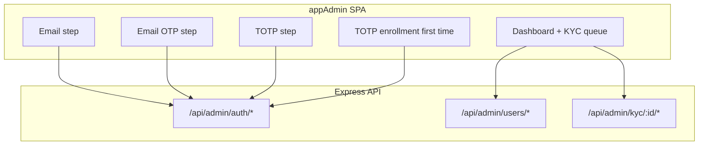

# vPay Admin Portal (`appAdmin`)

## Current state

| Area | Today |
|------|--------|
| Admin actions | CLI in [`backend/scripts/admin-kyc.ts`](backend/scripts/admin-kyc.ts) + HTTP routes in [`backend/src/routes/admin.ts`](backend/src/routes/admin.ts) guarded by `x-admin-key` |
| User model | No `adminUser` column ([`backend/prisma/schema.prisma`](backend/prisma/schema.prisma)) |
| App auth | Email OTP only ([`backend/src/routes/auth.ts`](backend/src/routes/auth.ts)); no TOTP |
| Mobile branding | Emerald/teal palette + Inter + VPay wordmark ([`mobile/constants/theme.ts`](mobile/constants/theme.ts), [`mobile/components/VPayWordmark.tsx`](mobile/components/VPayWordmark.tsx)) |
| directPay | Per-user idempotency only; **no platform-wide singleton** ([`backend/src/directpay/provision.ts`](backend/src/directpay/provision.ts)) |

## Architecture



**Auth model:** Same `users` row as the mobile app. `adminUser = true` grants portal access. Login is **three steps**:

1. **Email OTP** — reuse existing `saveOtp` / `sendOtpEmail` flow, but reject non-admin emails.
2. **TOTP** — authenticator app (Google Authenticator, 1Password, etc.).
3. **Admin JWT** — short-lived session token (`8h`) with claims `{ sub, email, admin: true, totp: true }`.

Between steps 1 and 2, return a **pre-auth JWT** (`5 min`, `{ preAuth: true }`) so the client cannot skip TOTP.

**First-time admin:** After email OTP, if `adminTotpSecret` is unset → show QR enrollment screen → `confirm-totp` stores encrypted secret before issuing full admin JWT.

---

## Phase 1 — Database and backend auth

### Prisma migration

Add to `User` in [`backend/prisma/schema.prisma`](backend/prisma/schema.prisma):

```prisma
adminUser           Boolean   @default(false) @map("admin_user")
adminTotpSecret     String?   @map("admin_totp_secret")   // AES-encrypted base32 secret
adminTotpEnabledAt  DateTime? @map("admin_totp_enabled_at")
```

Migration file: `backend/prisma/migrations/..._admin_user_totp/migration.sql`

**Bootstrap script** (new): `backend/scripts/set-admin-user.ts`

```bash
npx tsx scripts/set-admin-user.ts owner@vpay.com
```

Sets `adminUser = true` for an existing user (does not create users).

### New dependencies (backend)

- `otplib` — TOTP generate/verify
- `qrcode` — QR data URL for enrollment UI

### New modules

| File | Responsibility |
|------|----------------|
| [`backend/src/totp.ts`](backend/src/totp.ts) | Generate secret, `otpauth://` URI, verify code; encrypt/decrypt secret with `JWT_SECRET` (or dedicated `ADMIN_TOTP_KEY`) |
| [`backend/src/routes/admin-auth.ts`](backend/src/routes/admin-auth.ts) | Admin-only auth endpoints |
| [`backend/src/middleware/admin-auth.ts`](backend/src/middleware/admin-auth.ts) | `requireAdminJwt`, `requireAdminPreAuth` |

### Admin auth routes

| Method | Path | Purpose |
|--------|------|---------|
| `POST` | `/api/admin/auth/send-otp` | Email must exist + `adminUser=true`; sends OTP |
| `POST` | `/api/admin/auth/verify-otp` | Validates OTP → returns `{ preAuthToken, totpRequired, totpEnrolled }` |
| `POST` | `/api/admin/auth/setup-totp` | Pre-auth only; returns `{ qrDataUrl, manualSecret }` |
| `POST` | `/api/admin/auth/confirm-totp` | Pre-auth; verifies first TOTP code, persists secret |
| `POST` | `/api/admin/auth/verify-totp` | Pre-auth; verifies TOTP → returns `{ token, admin }` |
| `GET` | `/api/admin/auth/me` | Full admin JWT; returns admin profile |

Extend [`backend/src/auth.ts`](backend/src/auth.ts) with `signAdminToken`, `signPreAuthToken`, and typed payload variants.

### Harden existing admin ops routes

Update [`backend/src/routes/admin.ts`](backend/src/routes/admin.ts):

- Replace `requireAdmin` (API key only) with **dual guard**: `x-admin-key` **OR** valid admin JWT (`admin: true`).
- Add KYC status guards to mirror CLI:
  - Approve/reject only when `kycStatus === PENDING`
  - Idempotent approve when already approved (log-friendly 200)
- Return structured errors the UI can display.

### directPay singleton enforcement

In [`backend/src/directpay/provision.ts`](backend/src/directpay/provision.ts), before provisioning:

```typescript
const existingMerchant = await prisma.user.findFirst({
  where: { directPayBusinessId: { not: null }, id: { not: userId } },
});
if (existingMerchant) {
  throw new DirectPayMerchantAlreadyProvisionedError(existingMerchant.email);
}
```

Surface this in admin route + CLI with a clear message: *"directPay merchant already linked to {email}"*.

### Admin user listing / detail APIs

New [`backend/src/routes/admin-users.ts`](backend/src/routes/admin-users.ts):

| Method | Path | Purpose |
|--------|------|---------|
| `GET` | `/api/admin/users` | Paginated list; filters: `kycStatus`, `search` (email/name), `stripeStatus`, `directPayStatus` |
| `GET` | `/api/admin/users/:userId` | Full admin detail: profile, KYC docs, card summary, provisioning flags |
| `GET` | `/api/admin/stats` | Counts: pending KYC, active cards, directPay merchant holder |

Extend `toPublicUser` or add `toAdminUser` with fields needed for ops (virtual card count, `cardIssuancePaidAt`, etc.) — **never expose** `adminTotpSecret`.

KYC images: document URLs are relative (`/uploads/...`); admin UI prefixes with `VITE_API_URL`.

Wire routes in [`backend/src/index.ts`](backend/src/index.ts).

Update [`backend/.env.example`](backend/.env.example) with optional `ADMIN_TOTP_ISSUER=vPay Admin`.

---

## Phase 2 — `appAdmin` web app (Vite + React + Tailwind)

### Package scaffold

```
appAdmin/
├── package.json          # vite, react, react-router-dom, tailwind, @fontsource/inter
├── vite.config.ts        # dev proxy /api → localhost:3001
├── tailwind.config.ts    # emerald palette from mobile/constants/theme.ts
├── .env.example          # VITE_API_URL=http://localhost:3001
└── src/
    ├── main.tsx
    ├── App.tsx           # react-router routes + auth guard
    ├── lib/api.ts        # fetch wrapper (mirror mobile/lib/api.ts)
    ├── lib/auth-storage.ts
    ├── constants/theme.ts
    ├── contexts/AdminAuthContext.tsx
    ├── components/
    │   ├── VPayWordmark.tsx      # port SVG from mobile
    │   ├── OtpInput.tsx          # 6-digit input
    │   ├── AdminLayout.tsx       # sidebar + top bar
    │   ├── StatusBadge.tsx
    │   ├── ConfirmDialog.tsx
    │   └── DocumentViewer.tsx    # front/back KYC images
    └── pages/
        ├── LoginPage.tsx         # email → OTP → TOTP steps
        ├── TotpSetupPage.tsx     # QR + manual key + confirm
        ├── DashboardPage.tsx     # stats cards + quick links
        ├── KycQueuePage.tsx      # PENDING table, approve/reject
        └── UserDetailPage.tsx    # search by email; all admin actions
```

Root [`package.json`](package.json) scripts:

```json
"admin": "npm run dev --prefix appAdmin",
"admin:build": "npm run build --prefix appAdmin"
```

Update [`AGENTS.md`](AGENTS.md) monorepo structure to include `appAdmin/`.

### Design system (financial-grade UI)

Match mobile branding:

- **Colors:** emerald600 `#059669` primary, emerald950/teal900 gradients for auth hero, gray neutrals, red for destructive actions
- **Typography:** Inter (400/500/600/700) via `@fontsource/inter`
- **Wordmark:** blue V `#1A4DB8`, gold accent `#E8A020`, "AFRICA" subtitle
- **Layout:** Fixed left sidebar (nav: Dashboard, KYC Queue, Users), clean data tables, generous whitespace, subtle borders — no playful/mobile-only patterns
- **Auth screen:** Split layout — brand panel (gradient + wordmark + security copy) + form panel (mirrors [`mobile/app/(auth)/onboarding.tsx`](mobile/app/(auth)/onboarding.tsx) tone but desktop-optimized)

### Key screens and actions

**LoginPage** — multi-step wizard:
1. Email input → `POST /api/admin/auth/send-otp`
2. 6-digit OTP → `verify-otp` → store `preAuthToken`
3. If `!totpEnrolled` → redirect to TotpSetupPage
4. Else 6-digit TOTP → `verify-totp` → store admin JWT → Dashboard

**KycQueuePage**
- Table: name, email, submitted date, document type
- Row click → detail drawer with `DocumentViewer`
- **Approve** → `POST /api/admin/kyc/:userId/approve`
- **Reject** → modal with reason → `POST /api/admin/kyc/:userId/reject`

**UserDetailPage** (reachable from queue or email search)
- Profile + status badges (KYC, Stripe card, directPay)
- Action cards with confirmations:
  - **Issue card (free)** → `provision-card { charge: false }`
  - **Issue card (charge user)** → `provision-card { charge: true }`
  - **Connect directPay** → `provision-directpay` (disabled + tooltip if another user holds merchant)
- Show provisioning errors inline from `stripeProvisioningError` / `directPayProvisioningError`

### Client auth storage

- `localStorage`: `vpay_admin_token`, `vpay_admin_preauth` (cleared after TOTP)
- `AdminAuthContext`: bootstrap via `GET /api/admin/auth/me`; redirect to `/login` on 401
- Auto-logout on token expiry

---

## Phase 3 — Integration and safety

- **CORS:** Ensure backend `cors()` allows `appAdmin` dev origin (`http://localhost:5173`) — configure via env if needed.
- **Audit logging:** Log admin actions (approve, reject, provision) with `adminUserId` + target `userId` in existing [`backend/src/logger.ts`](backend/src/logger.ts).
- **CLI unchanged:** Keep `npm run admin:*` scripts for terminal ops; they remain useful for automation.
- **Mobile unaffected:** Regular `/api/auth/*` does not expose admin endpoints; `adminUser` users still use mobile normally.

---

## Test plan

1. Run migration; `set-admin-user.ts owner@vpay.com`
2. Start backend + `npm run admin`
3. Login as non-admin email → blocked at send-otp
4. Login as admin: email OTP → enroll TOTP (scan QR) → dashboard
5. Second login: email OTP → TOTP only (no re-enrollment)
6. Submit KYC from mobile test user → appears in KYC queue → approve
7. Issue card (free) and (charge) from User detail
8. Provision directPay for user A → succeeds; attempt user B → clear error
9. Verify CLI scripts still work with `ADMIN_API_KEY`
