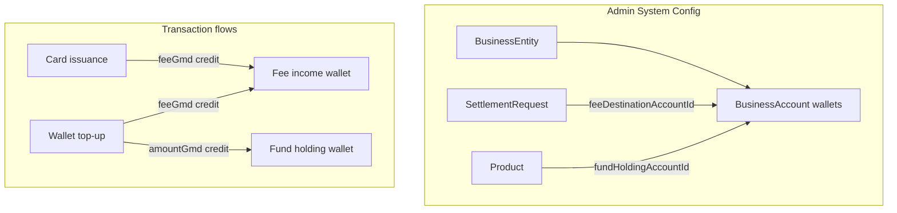

# Business Entities: Vendor Income Accounts

## Context

Fees are already computed via the catalog (`Product` → `SettlementRequest` → `Ucp`) and applied on **wallet top-up** and **card issuance**. Today, collected fees are implicit — they are not credited to any platform account. Customer funds live in per-user [`VPayWallet`](backend/prisma/schema.prisma).

This feature introduces **internal platform ledger accounts** under **Business Entities** so admins can:

1. Create a vendor entity (starting with type **Income vendor fee**)
2. Add multiple wallets/accounts under that entity
3. Assign each fee charge (settlement rule) to a destination wallet
4. Assign each product's principal fund flow to a holding wallet
5. Post ledger entries automatically when transactions complete

---

## 1. Database schema

Add to [`backend/prisma/schema.prisma`](backend/prisma/schema.prisma):

**Enums**
- `BusinessEntityType`: `VENDOR_INCOME` (extensible later: `MERCHANT`, `PARTNER`)
- `BusinessAccountPurpose`: `FEE_INCOME`, `FUND_HOLDING`, `SETTLEMENT`, `OTHER`
- `BusinessAccountTxnType`: `CREDIT`, `DEBIT`

**Models**

| Model | Purpose |
|-------|---------|
| `BusinessEntity` | Top-level business party (`code`, `name`, `type`, `description`, `status`) |
| `BusinessAccount` | Wallet under an entity (`entityId`, `code`, `name`, `currency`, `purpose`, `balance`, `status`) |
| `BusinessAccountTransaction` | Immutable ledger line (`accountId`, `type`, `amount`, `balanceBefore`, `balanceAfter`, `referenceType`, `referenceId`, `productCode?`, `ucpCode?`, `description?`, `metadata?`) |

**Routing FKs on existing catalog**
- `SettlementRequest.feeDestinationAccountId` → `BusinessAccount` (nullable; used when linked UCP `unit = FEES`)
- `Product.fundHoldingAccountId` → `BusinessAccount` (nullable; platform pool for principal on that product)

Constraints:
- `@@unique([entityId, code])` on `BusinessAccount`
- `@@unique` on `BusinessEntity.code`
- Restrict delete on accounts referenced by products/settlements (409 from API)

Migration: `backend/prisma/migrations/20250704140000_business_entities/migration.sql`

**Seed** in [`backend/scripts/seed-system-catalog.ts`](backend/scripts/seed-system-catalog.ts) (or new `seed-business-entities.ts`):
- Entity: `platform-fee-income` / "Platform Fee Income" (`VENDOR_INCOME`)
- Accounts (GMD):
  - `wallet-topup-fees` — `FEE_INCOME`
  - `card-issuance-fees` — `FEE_INCOME`
  - `customer-funds-pool` — `FUND_HOLDING`
- Wire existing settlement requests:
  - wallet-topup fee → `wallet-topup-fees`
  - card-issuance fee → `card-issuance-fees`
- Wire products:
  - `wallet-topup`, `card-fund` → `customer-funds-pool`

---

## 2. Backend ledger service

New [`backend/src/business-accounts/service.ts`](backend/src/business-accounts/service.ts):

- `creditBusinessAccount({ accountId, amount, referenceType, referenceId, productCode?, ucpCode?, description?, metadata? })`
- `resolveFeeDestinationAccount(productCode, ucpCode)` — reads active `SettlementRequest` with `feeDestinationAccountId`
- `resolveFundHoldingAccount(productCode)` — reads `Product.fundHoldingAccountId`
- Atomic balance update + `BusinessAccountTransaction` insert (same pattern as [`backend/src/wallet/service.ts`](backend/src/wallet/service.ts))

Posting is **best-effort with logging** if no account configured (preserves current behavior); once configured, always post.

---

## 3. Wire transaction flows

| Flow | File | Posting |
|------|------|---------|
| Wallet top-up paid | [`backend/src/routes/directpay-webhook.ts`](backend/src/routes/directpay-webhook.ts) (after `creditWalletFromFundingOrder`) | Credit fund-holding account `amountGmd`; credit fee account `feeGmd` from `FundingOrder` |
| Card issuance fee | [`backend/src/routes/card-issuance.ts`](backend/src/routes/card-issuance.ts) (after `debitWallet`) | Credit fee account `feeGmd` |
| Card fund | [`backend/src/routes/card-fund.ts`](backend/src/routes/card-fund.ts) | Credit fund-holding account `amountGmd` on debit (optional v1 — no fee today) |

Reference types: `funding_order`, `wallet_transaction`, `card_fund_transaction`.

---

## 4. Admin API routes

Follow patterns from [`backend/src/routes/admin-services.ts`](backend/src/routes/admin-services.ts):

| File | Endpoints |
|------|-----------|
| [`backend/src/routes/admin-business-entities.ts`](backend/src/routes/admin-business-entities.ts) | `GET/POST /api/admin/business-entities`, `GET/PATCH/DELETE /:id` |
| [`backend/src/routes/admin-business-accounts.ts`](backend/src/routes/admin-business-accounts.ts) | `GET/POST /api/admin/business-accounts?entityId=`, `GET/PATCH/DELETE /:id`, `GET /:id/transactions` (cursor paginated) |

Extend existing routes:
- [`backend/src/routes/admin-settlement-requests.ts`](backend/src/routes/admin-settlement-requests.ts) — accept/return `feeDestinationAccountId`
- [`backend/src/routes/admin-products.ts`](backend/src/routes/admin-products.ts) — accept/return `fundHoldingAccountId`

Register in [`backend/src/index.ts`](backend/src/index.ts).

---

## 5. Permissions

Add to [`backend/src/admin/permissions.ts`](backend/src/admin/permissions.ts):
- `system-config-business-entities` (view/edit/delete)

Re-run [`backend/scripts/seed-admin-permissions.ts`](backend/scripts/seed-admin-permissions.ts).

Update [`appAdmin/src/components/PermissionMatrix.tsx`](appAdmin/src/components/PermissionMatrix.tsx) labels.

---

## 6. Admin portal UI

**Navigation** — under System config in [`appAdmin/src/components/AdminLayout.tsx`](appAdmin/src/components/AdminLayout.tsx):
- `/system/business-entities` → Business Entities

**New page** [`appAdmin/src/pages/system/BusinessEntitiesPage.tsx`](appAdmin/src/pages/system/BusinessEntitiesPage.tsx):
- Master–detail pattern (clone from [`ServicesPage.tsx`](appAdmin/src/pages/system/ServicesPage.tsx))
- Left: entity list; right: entity detail + nested accounts table
- Create entity modal (type defaults to `VENDOR_INCOME`)
- Inline create/edit accounts (name, code, currency, purpose, status)
- Account detail shows balance + recent transactions (read-only)

**API client** — extend [`appAdmin/src/lib/api.ts`](appAdmin/src/lib/api.ts):
- Types: `BusinessEntitySummary`, `BusinessAccountSummary`, `BusinessAccountTransaction`
- CRUD: `fetchBusinessEntities`, `createBusinessEntity`, `fetchBusinessAccounts`, etc.

**Existing pages** — small additions:
- [`SettlementRequestsPage.tsx`](appAdmin/src/pages/system/SettlementRequestsPage.tsx): dropdown to pick fee destination account (filter accounts with `FEE_INCOME` purpose)
- [`ProductsPage.tsx`](appAdmin/src/pages/system/ProductsPage.tsx): dropdown for fund holding account (`FUND_HOLDING` purpose)

**Route** in [`appAdmin/src/App.tsx`](appAdmin/src/App.tsx) with `RequirePermission moduleKey="system-config-business-entities"`.

---

## 7. Out of scope (follow-ups)

- External provider account mapping (DirectPay/Stripe IDs)
- Business account reports in Reports section (can add later using `BusinessAccountTransaction`)
- Card-fund fee UCP wiring (catalog supports it; no fee applied today)

## 8. Follow-up: Full double-entry bookkeeping

v1 posts **one-sided credits** to platform `BusinessAccount` wallets when fees and principal are recognized. A later phase should introduce **balanced journal entries** that tie customer `VPayWallet` movements to platform accounts:

- `JournalEntry` header (`id`, `referenceType`, `referenceId`, `description`, `postedAt`)
- `JournalLine` rows (`entryId`, `accountType` = `CUSTOMER_WALLET` | `BUSINESS_ACCOUNT`, `accountId`, `debit`, `credit`)
- Every customer wallet debit/credit paired with offsetting platform account line(s) so debits = credits
- Top-up example: credit customer wallet + credit fund-holding pool + credit fee-income (with offsetting debit from a "payments received" clearing account)
- Issuance example: debit customer wallet + credit fee-income wallet in one atomic journal
- Admin reports: trial balance, account statements, reconciliation vs external DirectPay settlements

This builds on the business-entity routing configured in this phase without changing admin UI for entities/accounts.

---

## Key files to change

| Area | Files |
|------|-------|
| Schema | `backend/prisma/schema.prisma`, new migration |
| Ledger | `backend/src/business-accounts/service.ts` |
| Runtime | `directpay-webhook.ts`, `card-issuance.ts`, `card-fund.ts` |
| Admin API | `admin-business-entities.ts`, `admin-business-accounts.ts`, `admin-settlement-requests.ts`, `admin-products.ts` |
| Seed | `backend/scripts/seed-system-catalog.ts` or new seed script |
| Admin UI | `BusinessEntitiesPage.tsx`, `SettlementRequestsPage.tsx`, `ProductsPage.tsx`, `api.ts`, `App.tsx`, `AdminLayout.tsx` |
