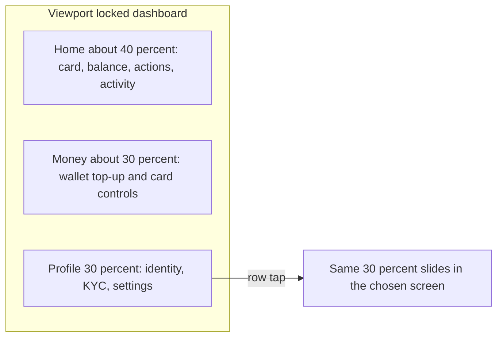

# Consumer web shell

This is a design preview to approve before any code. The consumer app stays in [mobile/](mobile/) (Expo + `react-native-web`, already started with `npm run mobile:web`). The admin portal in [appAdmin/](appAdmin/) is unchanged.

Brand tokens stay exactly as in [mobile/constants/theme.ts](mobile/constants/theme.ts): emerald `#059669` / `#ecfdf5`, gray canvas `#f9fafb`, white cards, Inter, radii 12–32. Wordmark stays the existing navy/blue `VPay` mark.

## What you will see

**Phone and narrow browser (under 1024px).** Same screens, tab bar, and stack pushes as the Android/iOS app. No desktop rearrangement.

**Android phone browser only.** A bottom sheet (existing [mobile/components/BottomSheet.tsx](mobile/components/BottomSheet.tsx)) on first visit:

- Title: vPay is on the Play Store
- Short line that the Android app is available
- Link: Open Play Store → `https://play.google.com/store/apps/details?id=gm.phantommetrics.vpay` (package from [mobile/app.json](mobile/app.json), overridable with `EXPO_PUBLIC_ANDROID_STORE_URL`)
- **Ignore** and **Use the web** both dismiss and remember the choice in `localStorage`, so it does not return every visit

iPhone, iPad, and desktop browsers do not get this sheet.

**Large screen (1024px and up), after sign-in.** One page, `100dvh`, no document scroll. Three columns. Profile is the right 30%.



Wireframe:

```
┌──────────────────────────────────────────────────────────────┐
│ VPay                                          Welcome, name  │
├────────────────────────────┬─────────────────┬───────────────┤
│ Virtual card + USD balance │ Wallet balance  │ Avatar + name │
│ Top up · New card · Limits │ Amount + source │ KYC status    │
│                            │ Top up          │ Personal      │
│ Activity search + filters  │ Fund / withdraw │ Security      │
│ Latest rows that fit       │ Freeze / delete │ Help, legal   │
│                            │                 │ Delete, logout│
└────────────────────────────┴─────────────────┴───────────────┘
```

Tapping a profile row does not push a full page. The right 30% slides over itself and loads that screen (personal details, security, help, tickets, terms, privacy, delete account) at roughly phone width, so those forms stay readable. A back control returns to the profile list.

Sign-in, OTP, and app lock stay the current mobile screens, centered in a ~420px column on the gray canvas so they do not stretch.

## How “no page scroll” works

The page itself never scrolls. The card, wallet summary, and profile list are sized to the viewport.

Two regions scroll inside their own box when content is taller than the space left:

- Activity list (search, wallet/card filters, and older rows)
- The 30% profile panel when a form or legal page is longer than the screen (KYC upload, terms)

Wallet checkout (amount, OTP, success) replaces the middle column in place. It does not navigate to another route.

## Implementation

- `useWebLayout`: `Platform.OS === 'web'` and width ≥ 1024. Native apps ignore it.
- Android prompt component, mounted from [mobile/app/_layout.tsx](mobile/app/_layout.tsx) only on web.
- `DesktopShell` used from [mobile/app/(tabs)/_layout.tsx](mobile/app/(tabs)/_layout.tsx) instead of the tab bar when the layout is desktop. Below 1024px the existing `Tabs` stay untouched.
- Reuse current data hooks and UI pieces (`useCards`, `useWallet`, `useCardActivity`, `ExpandableVirtualCard`, transaction rows, fund/card actions). Screen bodies gain an embedded mode so the desktop shell can place them in columns without a second copy of the business logic. Phone layout code paths stay as they are.
- Profile destinations keep their existing screens; on desktop they render inside the right panel instead of a stack push.

## Check after build

- Chrome device mode, Android UA, narrow width: sheet, then Ignore / Use the web, then the app-identical tab UI.
- Same width on a desktop UA: no sheet, same tab UI.
- ≥ 1024px: three columns, no page scrollbar, profile row opens and closes the 30% panel, wallet and card actions still complete.