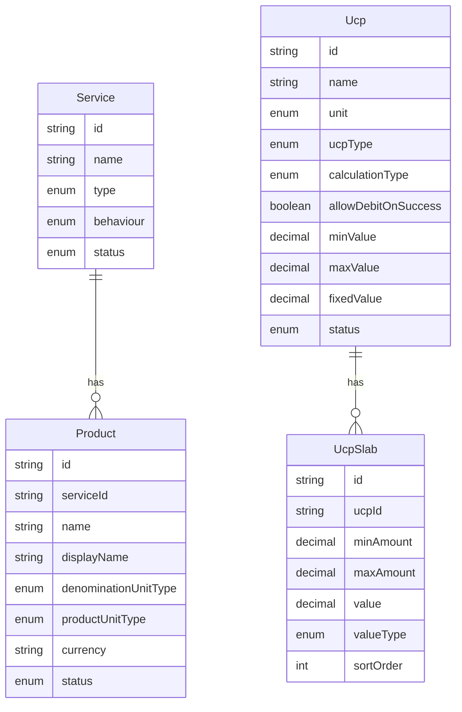

# System Config: Service, Product, and UCP

## Goal

Replace hardcoded/env-driven fee and product configuration with an admin-managed catalog. This phase is **admin CRUD only** — wallet, card funding, and settlement logic will consume these records in a follow-up.

## Architecture



**Relationships:**
- `Product` → `Service` (required FK; product picks parent service)
- `Ucp` is **standalone** (third System Config submenu); not linked to Product in this phase
- `UcpSlab` → `Ucp` (only used when `ucpType = SLAB`)

## 1. Prisma schema + migration

Add to [`backend/prisma/schema.prisma`](backend/prisma/schema.prisma):

**Shared enums:**
- `CatalogStatus`: `ACTIVE`, `INACTIVE`
- `ServiceType`: `INTERNAL`, `EXTERNAL`, `INTERNATIONAL`
- `ServiceBehaviour`: `TRANSACTIONAL`, `NON_TRANSACTIONAL`
- `DenominationUnitType`: `FLEX`, `FIXED`
- `ProductUnitType`: `MONETARY`, `NON_MONETARY`
- `UcpUnit`: `FEES`, `REWARD`, `SETTLEMENT`, `TAX`, `OTHER`
- `UcpType`: `FIXED`, `SLAB`
- `UcpCalculationType`: `INCLUSIVE`, `EXCLUSIVE`
- `UcpSlabValueType`: `PERCENT`, `FIXED_AMOUNT`

**Models** (follow admin catalog conventions: `cuid()` IDs, `@@map` snake_case tables, timestamps):

| Model | Key fields |
|-------|------------|
| `Service` | `name` (unique), `description?`, `type`, `behaviour`, `status` |
| `Product` | `name`, `displayName`, `description?`, `serviceId`, `denominationUnitType`, `productUnitType`, `startDate?`, `expiryDate?`, `currency` (3-letter), `status`; `@@unique([serviceId, name])` |
| `Ucp` | `name` (unique), `description?`, `unit`, `ucpType`, `calculationType`, `allowDebitOnSuccessfulTransaction`, `startDate?`, `expiryDate?`, `minValue?`, `maxValue?`, `fixedValue?` (required when FIXED), `status` |
| `UcpSlab` | `ucpId`, `minAmount`, `maxAmount?`, `value`, `valueType`, `sortOrder`; cascade delete with UCP |

**Migration:** `backend/prisma/migrations/20250701120000_system_config_catalog/migration.sql`

## 2. Backend API routes

Create three route files mirroring [`backend/src/routes/admin-groups.ts`](backend/src/routes/admin-groups.ts):

| File | Endpoints |
|------|-----------|
| [`backend/src/routes/admin-services.ts`](backend/src/routes/admin-services.ts) | `GET/POST /api/admin/services`, `GET/PATCH/DELETE /api/admin/services/:id` |
| [`backend/src/routes/admin-products.ts`](backend/src/routes/admin-products.ts) | `GET/POST /api/admin/products` (optional `?serviceId=`), `GET/PATCH/DELETE /api/admin/products/:id` |
| [`backend/src/routes/admin-ucps.ts`](backend/src/routes/admin-ucps.ts) | `GET/POST /api/admin/ucps`, `GET/PATCH/DELETE /api/admin/ucps/:id` |

**Patterns to reuse:**
- Zod create/update schemas + `formatZodError`
- `paramId()` helper, `formatX()` response mappers
- Exported `adminServicesAuthorize` / `adminProductsAuthorize` / `adminUcpsAuthorize` objects
- Register in [`backend/src/index.ts`](backend/src/index.ts) behind `requireAdminAccess`

**Validation rules:**
- `expiryDate >= startDate` when both set
- `FIXED` UCP: require `fixedValue`; reject `slabs` on create/update
- `SLAB` UCP: require ≥1 slab row; reject `fixedValue`; validate non-overlapping tiers ordered by `minAmount`
- Delete `Service` → 409 if any `Product` references it
- Unique name conflicts → 409

**UCP slab handling:** accept `slabs: SlabInput[]` in create/update body; on update, replace all slabs in a transaction (`deleteMany` + `createMany`).

## 3. Permissions

Extend [`backend/src/admin/permissions.ts`](backend/src/admin/permissions.ts):

```typescript
'system-config-services' | 'system-config-products' | 'system-config-ucps'
```

Add to `MODULES`, `SYSTEM_CONFIG_MODULES`, and `MODULE_ACTION_OVERRIDES` (view/edit/delete).

Run [`backend/scripts/seed-admin-permissions.ts`](backend/scripts/seed-admin-permissions.ts) after migration so Owner role and permission catalog pick up the new modules.

Update [`appAdmin/src/components/PermissionMatrix.tsx`](appAdmin/src/components/PermissionMatrix.tsx) `MODULE_LABELS`.

## 4. Admin portal — navigation + routes

**Sidebar** ([`appAdmin/src/components/AdminLayout.tsx`](appAdmin/src/components/AdminLayout.tsx)) — add to `systemNav`:

| Route | Label | moduleKey |
|-------|-------|-----------|
| `/system/services` | Services | `system-config-services` |
| `/system/products` | Products | `system-config-products` |
| `/system/ucp` | UCP | `system-config-ucps` |

**Routes** ([`appAdmin/src/App.tsx`](appAdmin/src/App.tsx)) — wrap each in `RequirePermission`.

## 5. Admin portal — pages + API client

**API client** ([`appAdmin/src/lib/api.ts`](appAdmin/src/lib/api.ts)): types + `fetch/create/update/delete` for services, products, ucps (include `slabs` on UCP payloads).

**Pages** (follow [`UserGroupsPage.tsx`](appAdmin/src/pages/system/UserGroupsPage.tsx) master/detail + create modal pattern):

| Page | UX notes |
|------|----------|
| [`ServicesPage.tsx`](appAdmin/src/pages/system/ServicesPage.tsx) | Left list, right detail form; enums as `<select>`; `StatusBadge` for active/inactive |
| [`ProductsPage.tsx`](appAdmin/src/pages/system/ProductsPage.tsx) | Service dropdown (loaded from `fetchServices`); date inputs for validity; currency text field; optional filter by service in list |
| [`UcpsPage.tsx`](appAdmin/src/pages/system/UcpsPage.tsx) | Full field set; when `ucpType = FIXED` show `fixedValue`; when `SLAB` show editable tier table (add/remove rows: min, max, value, valueType % vs amount) |

Shared UI: `PageHeader`, `EmptyState`, `ConfirmDialog`, existing `panel` / `data-table` / `btn-primary` classes from [`index.css`](appAdmin/src/index.css).

## 6. Explicitly out of scope (this phase)

- Wiring [`fund-config.ts`](backend/src/fund-config.ts) or transaction flows to read from DB
- Linking UCP to Product or Service
- Mobile app changes
- Runtime charge/settlement engine

Env vars (`FUND_FEE_PERCENT`, `CARD_ISSUANCE_FEE_USD`, etc.) stay as fallbacks until the next phase.

## 7. Verification

1. `npm run backend:db:migrate` + `npx tsx backend/scripts/seed-admin-permissions.ts`
2. Start backend + admin portal
3. As Owner: create a Service → Product under it → UCP (fixed and slab examples)
4. Confirm RBAC: operator without `system-config-*:view` cannot see nav items; API returns 403
5. Confirm delete guards (service with products, slab validation on UCP save)
