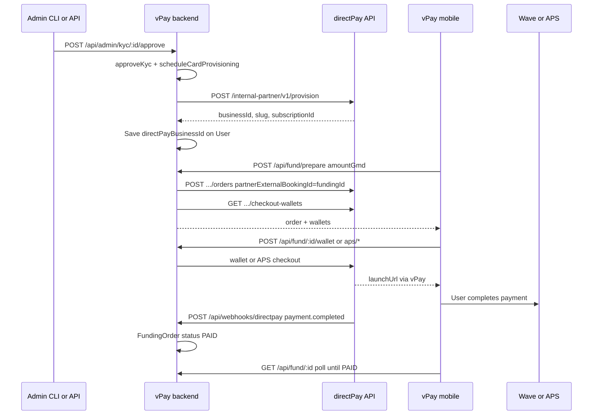

# vPay ↔ directPay internal partner integration

## Goal

Mirror the [7a-side ↔ directPay](file:///Users/mac/cody/Phantommetrics/directPay/docs/INTEGRATION_7ASIDE.md) pattern inside vPay:

- Each KYC-approved user gets a **comped directPay merchant** with **`partnerApp: "vpay"`** → `platformBillingWaived: true`, **perpetual CORPORATE subscription** (`CONTRACT_INFINITE` + `contractPerpetual: true`), **no platform invoices** (same comped mechanics as 7a-side BASIC, but CORPORATE entitlements).
- **Admin-driven provisioning** runs alongside existing Stripe card provisioning (same trigger as `admin:approve` / `POST /api/admin/kyc/:userId/approve`).
- **Fund checkout** uses directPay internal-partner order + wallet/APS APIs; payment completion arrives via HMAC webhook.

### directPay prerequisite (small change)

7a-side uses `partnerApp: "default"`, which hardcodes `PlanCode.BASIC` in [`internal-partner-provision.service.ts`](file:///Users/mac/cody/Phantommetrics/directPay/backend/src/services/internal-partner-provision.service.ts). vPay needs **CORPORATE** instead. The underlying helper [`createInternalPartnerForeverBasicSubscriptionForBusinessTx`](file:///Users/mac/cody/Phantommetrics/directPay/backend/src/services/subscription.service.ts) already accepts an optional `planCode` and creates a perpetual subscription with no invoices — only the plan row differs.

**Changes in directPay** (before or alongside vPay work):

| File | Change |
|------|--------|
| [`backend/src/services/internal-partner-provision.service.ts`](file:///Users/mac/cody/Phantommetrics/directPay/backend/src/services/internal-partner-provision.service.ts) | Extend `InternalPartnerApp` to `"default" \| "analytics-bi" \| "vpay"`. When `partnerApp === "vpay"`: `platformBillingWaived: true`, auto-subscribe with `planCode: PlanCode.CORPORATE` via `createInternalPartnerForeverBasicSubscriptionForBusinessTx`. Same checkout product + Wave auto-provision as `"default"`. |
| [`backend/src/app.ts`](file:///Users/mac/cody/Phantommetrics/directPay/backend/src/app.ts) | Add `"vpay"` to `internalPartnerProvisionBodySchema` `partnerApp` enum. |
| [`docs/INTEGRATION_VPAY.md`](file:///Users/mac/cody/Phantommetrics/directPay/docs/INTEGRATION_VPAY.md) (new) | Document vPay partner app: comped perpetual CORPORATE, provision body, env pairing. |

**Partner app comparison:**

| `partnerApp` | Billing waived | Auto subscription | Plan |
|--------------|----------------|-------------------|------|
| `default` (7a-side) | yes | yes, perpetual | BASIC |
| `vpay` | yes | yes, perpetual | **CORPORATE** |
| `analytics-bi` | no | no (manual start) | paid CORPORATE |

Checkout routes (`/orders`, `/checkout-wallets`, wallet/APS) are unchanged — same internal-partner API as 7a-side.

## Architecture



## 1. Database changes

**Migration** on [`backend/prisma/schema.prisma`](backend/prisma/schema.prisma):

**User** — add directPay provisioning fields (parallel to Stripe):

| Field | Type | Purpose |
|-------|------|---------|
| `directPayBusinessId` | `String?` | directPay `businessId` from provision |
| `directPaySlug` | `String?` | Merchant slug |
| `directPayProvisioningStatus` | enum `NONE \| PENDING \| ACTIVE \| FAILED` | Provision lifecycle |
| `directPayProvisioningError` | `String?` | Last error message |

**New `FundingOrder` model**:

| Field | Notes |
|-------|-------|
| `id` (uuid) | Used as `partnerExternalBookingId` for directPay idempotency |
| `userId` | FK to User |
| `amountGmd`, `feeGmd`, `totalGmd` | Match mobile fee logic (`2%` fee, same as [`mobile/lib/data.ts`](mobile/lib/data.ts)) |
| `usdEstimate` | `amountGmd / 71` for display |
| `status` | `PENDING \| PAID \| FAILED \| CANCELLED` |
| `directPayOrderId`, `directPayOrderPublicCode` | From create-order response |
| `directPayPaymentId` | From webhook |
| `metadata` | JSON — APS `authState`, webhook dedupe keys |
| `paidAt` | Set on `payment.completed` |

## 2. directPay partner client

Create [`backend/src/directpay/partner.ts`](backend/src/directpay/partner.ts) — adapt from [`7a-side/appBackend/src/services/easypayPartner.ts`](file:///Users/mac/cody/Phantommetrics/7a-side/appBackend/src/services/easypayPartner.ts):

- `getDirectPayPartnerConfig()` — reads `DIRECTPAY_API_BASE_URL` + `INTERNAL_PARTNER_API_SECRET`
- `provisionDirectPayTenant()` — `POST /provision` with **`partnerApp: "vpay"`** (comped perpetual CORPORATE)
- `createDirectPayOrder()`, `listDirectPayWallets()`, `startDirectPayWalletCheckout()`, `authorizeDirectPayApsWallet()`, `completeDirectPayApsWallet()`, `cancelDirectPayOrder()`
- Use native `fetch` (Node 22; no new dependency)

**Provision payload** (per user):

```typescript
{
  externalUserId: user.id,
  ownerEmail: user.email,
  ownerName: `${firstName} ${lastName}` or email local-part,
  businessName: `${displayName}-vpay`,
  slug: `vpay-${emailLocal}-${userId.slice(0,6)}`,
  industry: 'fintech',
  partnerApp: 'vpay',
  webhookUrl: `${VPAY_PUBLIC_API_URL}/api/webhooks/directpay`, // optional per-business override
}
```

**Known constraint:** directPay returns **409** if `ownerEmail` already exists as a directPay user ([`internal-partner-provision.service.ts` L117–121](file:///Users/mac/cody/Phantommetrics/directPay/backend/src/services/internal-partner-provision.service.ts)). Store error on user; admin can retry after resolving.

## 3. Merchant provisioning service

Create [`backend/src/directpay/provision.ts`](backend/src/directpay/provision.ts):

- `provisionUserDirectPayMerchant(userId)` — requires `kycComplete`, idempotent if `directPayBusinessId` already set
- Sets `directPayProvisioningStatus` → `PENDING` → `ACTIVE` or `FAILED`
- `scheduleDirectPayProvisioning(userId)` — fire-and-forget (same pattern as [`scheduleCardProvisioning`](backend/src/stripe/provision.ts))

**Hook into existing admin flows:**

| Trigger | File | Change |
|---------|------|--------|
| `POST /api/admin/kyc/:userId/approve` | [`backend/src/routes/admin.ts`](backend/src/routes/admin.ts) | Call `scheduleDirectPayProvisioning(user.id)` after approve |
| `npm run admin:approve` | [`backend/scripts/admin-kyc.ts`](backend/scripts/admin-kyc.ts) | Run directPay provision after Stripe provision |
| New `npm run admin:provision-directpay` | same script | Standalone retry command |
| New `POST /api/admin/kyc/:userId/provision-directpay` | [`backend/src/routes/admin.ts`](backend/src/routes/admin.ts) | Manual retry endpoint (admin key) |

Provisioning is **server-side only** (no mobile secret exposure), unlike 7a-side’s user-initiated `POST /easypay/onboarding`.

## 4. Fund API routes

Create [`backend/src/routes/fund.ts`](backend/src/routes/fund.ts) — mirror 7a-side booking easypay routes but self-service (user pays their own `directPayBusinessId`):

| Method | Path | Behavior |
|--------|------|----------|
| `POST` | `/api/fund/prepare` | Auth; body `{ amountGmd }`; requires `kycComplete` + `directPayBusinessId`; creates `FundingOrder` + directPay order; returns wallets |
| `POST` | `/api/fund/:id/wallet` | Start Wave/Yonna checkout; returns `launchUrl`, `qrPayload`, etc. |
| `POST` | `/api/fund/:id/aps/authorize` | APS step 1 |
| `POST` | `/api/fund/:id/aps/complete` | APS step 2 |
| `GET` | `/api/fund/:id` | Poll funding status |

Guards:

- 503 if directPay env not configured
- 409 if user not provisioned (`directPayBusinessId` missing)
- 400 if amount invalid or funding already `PAID`

Register routes in [`backend/src/index.ts`](backend/src/index.ts).

## 5. Inbound webhook

Create [`backend/src/routes/directpay-webhook.ts`](backend/src/routes/directpay-webhook.ts) — adapt from [`7a-side/appBackend/src/routes/easypayWebhook.ts`](file:///Users/mac/cody/Phantommetrics/7a-side/appBackend/src/routes/easypayWebhook.ts):

- Register **before** `express.json()`: `POST /api/webhooks/directpay` with `express.raw({ type: 'application/json' })`
- Verify `X-Easypay-Signature` with `INTERNAL_PARTNER_WEBHOOK_SECRET`
- On `payment.completed`: find `FundingOrder` by `partnerExternalBookingId` (= funding id), set `status: PAID`, store `directPayPaymentId`, dedupe by `paymentId + event`
- Handle `payment.failed` / `payment.cancelled` → `FAILED` / `CANCELLED`
- Return 2xx quickly

**Stripe balance credit (explicit gap):** webhook marks funding complete in vPay DB only. Moving GMD proceeds into the user’s Stripe USDC financial account is **not** implemented in this pass — card `balance` will not change until a future treasury/transfer step. Mobile success UI reflects `FundingOrder` status, not live Stripe balance.

## 6. Environment configuration

Update [`backend/.env.example`](backend/.env.example):

```env
# directPay internal partner (optional — fund + provision disabled when unset)
DIRECTPAY_API_BASE_URL=http://localhost:4000
INTERNAL_PARTNER_API_SECRET=shared-with-directPay
INTERNAL_PARTNER_WEBHOOK_SECRET=shared-with-directPay
VPAY_PUBLIC_API_URL=http://localhost:3001
```

**directPay** [`backend/.env`](file:///Users/mac/cody/Phantommetrics/directPay/backend/.env.example) (local dev):

- Ensure `INTERNAL_PARTNER_API_SECRET` matches vPay
- Add vPay webhook to `INTERNAL_PARTNER_WEBHOOK_URL` (comma-separated): `http://localhost:3001/api/webhooks/directpay`
- Set `INTERNAL_PARTNER_WEBHOOK_SECRET` to match vPay
- Platform owner must configure APS/Wave gateway credentials for provisioned `businessId`s (same ops step as 7a-side)

Update [`mobile/.env.example`](mobile/.env.example) only if needed (no partner secrets on mobile).

## 7. Mobile Fund screen

Update [`mobile/lib/api.ts`](mobile/lib/api.ts) + [`mobile/lib/types.ts`](mobile/lib/types.ts):

- Types for wallets, prepare response, checkout response, funding status
- API helpers: `prepareFund`, `startFundWallet`, `authorizeFundAps`, `completeFundAps`, `getFundingOrder`

Rewrite [`mobile/app/(tabs)/fund.tsx`](mobile/app/(tabs)/fund.tsx):

- Replace mock `handleFund` with `prepareFund` → wallet picker (reuse existing APS/Wave UI)
- On wallet select: call wallet or APS routes; open `launchUrl` via `Linking.openURL`
- Poll `GET /api/fund/:id` until `paid` (or timeout with friendly message)
- Show errors when directPay not configured / user not provisioned

Optional: expose `directPayProvisioningStatus` on `PublicUser` so Fund screen can show “Setting up payments…” when KYC approved but merchant not ready.

## 8. Documentation

Add [`docs/INTEGRATION_DIRECTPAY.md`](docs/INTEGRATION_DIRECTPAY.md) in vPay (ops setup, env pairing, local dev flow, gateway credential note). Optionally add a sibling doc in directPay mirroring `INTEGRATION_7ASIDE.md` — only if you want cross-repo parity.

## Local dev test plan

1. Start directPay (`localhost:4000`) + PostgreSQL; configure `INTERNAL_PARTNER_*` and webhook URL.
2. Start vPay backend (`localhost:3001`); run migration.
3. Complete user KYC in mobile → `npm run admin:approve -- user@example.com`
4. Verify user has `directPayBusinessId`, `directPayProvisioningStatus: active`, and directPay subscription is **CORPORATE** + `contractPerpetual: true` (via directPay admin or `GET /api/internal-partner/v1/businesses/:id/subscription`).
5. Platform admin: add Wave/APS credentials for that `businessId` in directPay.
6. Mobile Fund → prepare → wallet checkout → complete payment in sandbox.
7. Confirm webhook marks `FundingOrder` `PAID` and mobile shows success.

## Files touched (summary)

| Action | Path |
|--------|------|
| Edit (directPay) | `backend/src/services/internal-partner-provision.service.ts`, `backend/src/app.ts` |
| New (directPay) | `docs/INTEGRATION_VPAY.md` |
| New | `backend/src/directpay/partner.ts`, `provision.ts` |
| New | `backend/src/routes/fund.ts`, `directpay-webhook.ts` |
| New | `backend/prisma/migrations/*_directpay_funding/` |
| Edit | `backend/prisma/schema.prisma`, `index.ts`, `routes/admin.ts`, `scripts/admin-kyc.ts`, `db.ts`, `.env.example` |
| Edit | `mobile/app/(tabs)/fund.tsx`, `mobile/lib/api.ts`, `mobile/lib/types.ts` |
| New | `docs/INTEGRATION_DIRECTPAY.md` |
