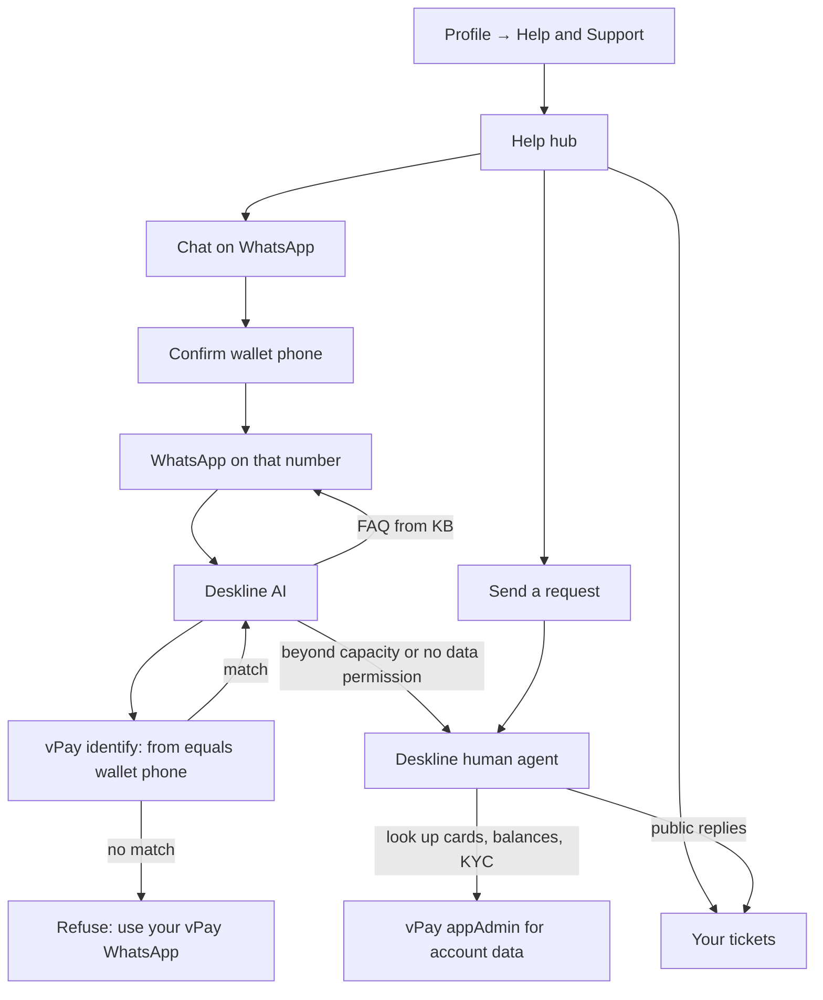

# WhatsApp chatbox + Deskline human escalation

## What should exist

Support stays **two channels, one CRM**:

- **WhatsApp chatbox** — first-line, 24/7. User taps Chat on WhatsApp from Help & Support; Deskline’s AI replies.
- **Deskline** — the separate CRM you already use (`deskline.phantommetrics.gm`). AI inbox + ticket queue for humans. In-app **Send a request** already creates Deskline tickets via [`backend/src/ticketing/client.ts`](backend/src/ticketing/client.ts).

Do **not** build a full WhatsApp bot inside vPay. Deskline already has WhatsApp Cloud API, knowledge-base answers, smart escalation, and staff takeover.

**New security rule:** the chatbot may only converse as that user if the **inbound WhatsApp sender is the same number as their vPay wallet**. Every wallet is keyed to a unique phone ([`User.phoneE164`](backend/prisma/schema.prisma), [`VPayWallet.phoneNumber`](backend/prisma/schema.prisma)). A different WhatsApp (family phone, new SIM, spoofed session) must not be treated as that account.

The app cannot force which number WhatsApp sends from. Binding happens **on the server**: compare Deskline’s inbound `from` (E.164) to `resolveUserPhoneE164(user)` / wallet `phoneNumber` using [`backend/src/phone.ts`](backend/src/phone.ts).



## Permission rules

Two layers:

**1. Identity — wallet phone only**

- Chat is allowed only when WhatsApp `from` equals the user’s unique wallet phone (`phoneE164` / `wallet.phoneNumber`).
- No match: canned reply — “Please message us from the WhatsApp number registered on your vPay wallet.” No name, account id, tickets, or escalation with customer context.
- No phone on the account: hide Chat on WhatsApp; they use **Send a request**.
- The bot still must **not** receive card PAN, CVV, balances, transactions, or KYC files. Identify returns only `{ allowed, userId, displayName }` — nothing financial.

**2. Capability — KB vs human**

| Bot may answer (after phone match) | Must escalate to a human |
| --- | --- |
| How to fund, verify, freeze a card in the app | “What’s my balance / last charge / card number?” |
| Fees, hours, general card/KYC steps | Disputes, fraud, failed payments, account deletion |
| Where to find tickets / Help in the app | Anything not in the knowledge base, or “talk to a person” |

Human agents work in **Deskline**. For data the bot is not allowed to see, they look it up in **appAdmin**. Existing ticket create already sends name, email, phone, account ID, and KYC status — not cards or balances.

## Phone bind (how it actually holds)

Opening `wa.me` does not prove sender identity. Use **both** UX and a signed session:

1. Logged-in user taps Chat on WhatsApp.
2. Backend issues a short-lived token (HMAC/JWT, ~10 min) bound to `{ userId, phoneE164 }`.
3. Prefill is something like `vPay help <token>` so the first WhatsApp message carries the token.
4. Deskline (webhook or identify call) sends vPay `{ from, token }`.
5. vPay allows only if `normalize(from) === token.phoneE164 === user.phoneE164` (and token not expired). Copying the token to another WhatsApp fails the `from` check.

Deskline must call this identify endpoint on inbound WhatsApp (or equivalent contact-match). Until that is wired, the app confirm screen is UX only and is **not** sufficient security.

## What you need to configure in Deskline (outside this repo)

1. **WhatsApp Business** — Meta Business + Business number. Channels → connect WhatsApp Cloud API.
2. **Knowledge base** — vPay FAQ plus: chat only from the registered wallet WhatsApp; we never share balances or card details in chat.
3. **AI profile** — KB only; escalate when unsure or when account-specific data is requested; never ask for PAN/CVV/PIN.
4. **Identify hook** — on inbound WhatsApp, call vPay verify with sender E.164 + first-message token; unmatched senders get the canned refusal, not the AI as that customer.
5. **Smart escalation** — escalate-to-ticket / staff takeover for matched chats only.
6. **Staff** — same queue as in-app **Send a request**.
7. Confirm `TICKETING_API_BASE_URL` / `TICKETING_API_KEY` ([`backend/.env.example`](backend/.env.example) lines 89–94).

Until WhatsApp is connected **and** identify is wired, hide the Chat card or show that WhatsApp support is not available.

## What we change in vPay

**Backend**

- Extend support config (from `GET /api/support/tickets` or a small `GET /api/support/whatsapp`) with:

```ts
whatsapp: {
  enabled: boolean;          // env number set AND user has phoneE164
  supportE164: string;       // vPay support WhatsApp (destination)
  walletPhoneE164: string;   // this user's wallet number (sender that must match)
  walletPhoneMasked: string; // e.g. +220 ••• ••12
}
```

- `POST /api/support/whatsapp/session` (user JWT): mint the short-lived token; 409/400 if no phone.
- `POST /api/webhooks/deskline/whatsapp-identify` (Deskline API key / shared secret): `{ from, token? }` → `{ allowed, userId?, displayName? }`. Compare with `resolveUserPhoneE164`. No balances, cards, or KYC payload.
- Env: `WHATSAPP_SUPPORT_E164`, plus webhook secret. If support number unset, `enabled: false`.

**Mobile** — [`mobile/app/help-support.tsx`](mobile/app/help-support.tsx):

- Hub card **Chat on WhatsApp** (first): “Chat from your vPay WhatsApp number.”
- Before `wa.me`: show the **masked wallet phone** and confirm they must open WhatsApp logged into that number (the wallet SIM).
- Prefill includes the session token (not the raw account id).
- If WhatsApp is missing: alert. If no phone on file: card disabled / “Add your phone in Profile.”
- Keep **Your tickets** and **Send a request** (written path; no WhatsApp-on-that-SIM required).

**Do not** add WhatsApp or ticket UI to appAdmin. Agents stay in Deskline.

## What we will not build now

- A custom WhatsApp Cloud API / Twilio bot in the vPay backend (Deskline still owns the chatbox)
- Giving Deskline APIs for cards, wallets, or transactions (identify/allow only)
- In-app live chat widget
- Webhook sync of WhatsApp-escalated tickets into **Your tickets** (optional later)

## After Deskline is live

Need the support WhatsApp Business number (E.164) and a Deskline identify/webhook we can call (or that can call vPay). App work is the hub card, wallet-phone confirm, session token, and identify endpoint.
