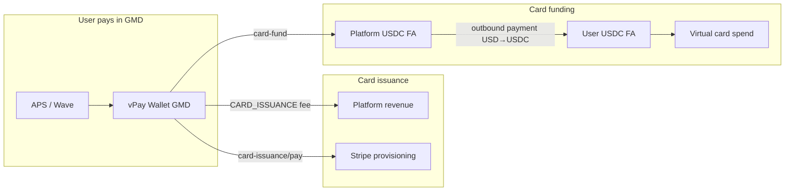

# Stripe Stablecoin + Issuing for vPay

vPay uses **Stripe Connect v2** with **USDC financial accounts** and **stablecoin-backed Issuing** so you can issue prepaid virtual cards to users in supported markets (including The Gambia and 30+ other countries) without a separate local card program.

This is a **private preview** product. Your Stripe account must be enrolled before production use.

## What is already built in vPay

| Step | Code |
|------|------|
| Create connected account (storer + card_creator) | `backend/src/stripe/connect.ts` |
| Create USDC financial account per user | `backend/src/stripe/connect.ts` |
| Enable Issuing program on connected account | `backend/src/stripe/issuing.ts` |
| Create cardholder + virtual card | `backend/src/stripe/issuing.ts` |
| Charge issuance fee from vPay wallet | `POST /api/card-issuance/pay` |
| Fund card balance (wallet → USDC) | `backend/src/stripe/outbound-payments.ts` |
| Dev/test inbound transfers | `backend/src/stripe/dev-inbound-payment.ts` |

## Prerequisites (Stripe side)

1. **Contact Stripe** to enroll in [stablecoin-backed Issuing](https://docs.stripe.com/issuing/stablecoin-cards-for-financial-accounts) (private preview).
2. Platform must be based in the **US or Europe**.
3. Connected accounts (your users) must be in an **approved country** (Gambia is typically supported in the Africa rollout — confirm with your Stripe rep).
4. Stripe provides your **`STRIPE_ISSUING_PLATFORM_PROGRAM`** (`iprg_...`) after onboarding.
5. Use a **Stripe sandbox** (not legacy test mode) for v2 API development.

## Environment variables

Add to `backend/.env`:

```bash
# Core Stripe
STRIPE_SECRET_KEY=sk_test_...
STRIPE_PUBLISHABLE_KEY=pk_test_...
STRIPE_WEBHOOK_SECRET=whsec_...
STRIPE_API_VERSION=2026-05-27.preview

# Stablecoin Issuing (from Stripe after preview enrollment)
STRIPE_ISSUING_PLATFORM_PROGRAM=iprg_...

# Platform USDC pool — fund card balances via outbound payments
STRIPE_PLATFORM_FINANCIAL_ACCOUNT_ID=fa_...

# Card issuance fee (debited from vPay wallet in GMD before Stripe provisioning)
CARD_ISSUANCE_FEE_USD=1.5
FUND_EXCHANGE_RATE=71
# Virtual card expiration passed to Stripe on create (years from issue date)
CARD_EXPIRY_YEARS=1

# Remove for production stablecoin — currency auto-defaults to USD when program is set
# STRIPE_ISSUING_CURRENCY=gbp
# Pre-stablecoin only: optional billing remap overrides (GM users auto-map to GB by default)
# STRIPE_TEST_CARDHOLDER_COUNTRY=gb
# STRIPE_TEST_CARDHOLDER_POSTAL_CODE=SW1A 1AA
```

When `STRIPE_ISSUING_PLATFORM_PROGRAM` is set, vPay automatically:

- Creates v2 accounts with `storer` (USDC) + `card_creator` (Lead prepaid card)
- Uses **USD** card currency
- Sends **Lead bank** terms acceptance on cardholders
- Funds cards via **outbound payments** (platform FA → connected FA, USD → USDC)

## Setup checklist

### 1. Run database migration

```bash
npm run backend:db:migrate
```

### 2. Fund your platform financial account

Per [Stripe docs](https://docs.stripe.com/issuing/stablecoin-cards-for-financial-accounts#fund-your-platform-financial-account):

1. List platform financial accounts (sandbox Dashboard or API).
2. Create a **US bank financial address** on the platform FA.
3. Wire/ACH test funds into that address.

Then discover the FA id:

```bash
cd backend && npx tsx scripts/setup-stripe-platform-financial-account.ts
```

Copy the printed `STRIPE_PLATFORM_FINANCIAL_ACCOUNT_ID` into `.env`.

### 3. Configure webhooks

Point Stripe webhooks to:

```
POST https://<your-api>/api/webhooks/stripe
```

Subscribe at minimum to `issuing_card.updated` and account capability events.

### 4. End-to-end user flow

1. User completes KYC → admin approves (`npm run admin:approve -- user@example.com`)
2. User tops up vPay wallet via **Fund** (APS/Wave via directPay, or simulation in dev)
3. User taps **Issue card** on home → pays issuance fee (`POST /api/card-issuance/pay`)
4. Backend provisions Stripe card asynchronously
5. User funds card from wallet → USDC credited via outbound payment
6. User spends with the virtual card

### 5. Admin / dev shortcuts

```bash
# Approve KYC
npm run admin:approve -- user@example.com

# Provision card free (admin only, no wallet debit)
npm run admin:provision -- user@example.com

# Provision card and charge user's wallet (admin)
npm run admin:provision -- user@example.com --charge

# Or via API (X-Admin-Key header):
# POST /api/admin/kyc/:userId/provision-card  body: { "charge": false }
# POST /api/admin/kyc/:userId/provision-card  body: { "charge": true }

# Dev: setup inbound test payment method for sandbox card funding
npx tsx scripts/setup-stripe-test-inbound.ts user@example.com
```

## Money flow



## Troubleshooting

| Symptom | Likely cause |
|---------|----------------|
| Provisioning fails immediately | Missing `STRIPE_ISSUING_PLATFORM_PROGRAM` or preview not enabled |
| `Card issuance fee must be paid` | User must call `/api/card-issuance/pay` before provisioning |
| Card balance stays 0 after fund | `STRIPE_PLATFORM_FINANCIAL_ACCOUNT_ID` unset or platform FA has no USD |
| Capabilities not active | KYC on connected account incomplete; wait up to 1 business day |
| `Cardholder cannot have a billing address country of GM` | Pre-stablecoin UK sandbox — auto-mapped to GB billing in code; ensure `STRIPE_ISSUING_PLATFORM_PROGRAM` is unset/placeholder until enrolled |
| UK test address errors | Remove `STRIPE_TEST_CARDHOLDER_COUNTRY=gb` after stablecoin preview is enabled |

## References

- [Stablecoin-backed cards for Financial Accounts](https://docs.stripe.com/issuing/stablecoin-cards-for-financial-accounts)
- [Use stablecoins in your financial account](https://docs.stripe.com/treasury/stablecoins)
- [Issuing testing](https://docs.stripe.com/issuing/testing)
